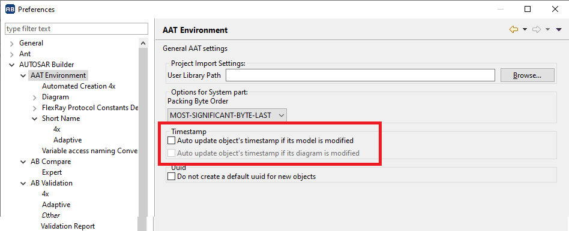

# 1. arxml_toys

## 1.1. Purpose

The Power Toys to manage the AUTOSAR ARXML file easily.

## 1.2. Remove or update the UUID from ARXML

### 1.2.1. Usage 

```
$ arxml_uuid

arxml_uuid [-a|--arxml name][--remove][-h|-help]
Remove or update the uuid from the specific arxml
   -a|--arxml name : The filename of arxml
   --remove        : Remove the UUID
   -h|--help       : Show the help information.
```

### 1.2.2. Update the UUID

update the test.arxml with the new generated UUID

**Example:**

```
arxml_uuid -a test.arxml
```

### 1.2.3. Remove the UUID

remove all UUID from test.arxml

**Example:**

```
arxml_uuid -a test.arxml --remove
```

## 1.3. Remove the timestamp from ARXML

### 1.3.1. Usage 

```
$ arxml_timestamp

arxml_timestamp [-a|--arxml name][-h|-help]
Remove the timestamp from the specific arxml
   -a|--arxml name : The filename of arxml
   -h|--help       : Show the help information.
```

### 1.3.2. Turn off the timestamp in AUTOSAR builder

Uncheck the "Auto update object's timestamp if its model is modified" option.



### 1.3.3. Remove the timestamp

remove all timestamp attributes from test.arxml

**Example:**

```
arxml_timestamp -a test.arxml
```

## 1.4. Create a distribution and wheel for release

Run `python setup.py sdist bdist_wheel`
or `py -3 setup.py sdist bdist_wheel`